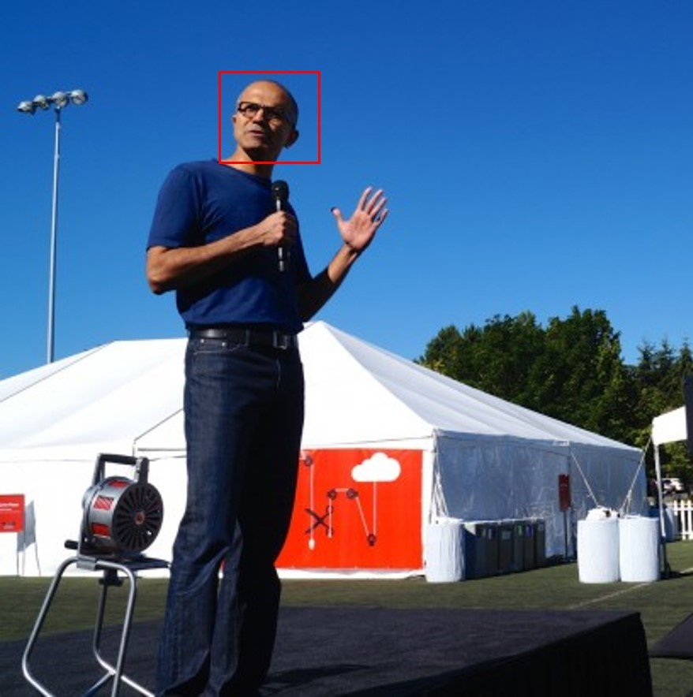

<!-- 
NavPath: Computer Vision API
LinkLabel: Developing with Domain-specific Models
Url: Computer-Vision-API/documentation/Domain-specificModels
Weight: 97
-->

#Developing with Domain-Specific Models

In addition to tagging and top-level categorization, Vision API will also support specialized (or domain-specific) information. Specialized information can be implemented as a standalone method or in combination with the high level categorization. In a nutshell, think of specialized information as a way to further refine the 86 category taxonomy via domain-specific models. 

Currently, the only specialized information supported is celebrity recognition, and it is essentially a domain-specific refinement for the people_ and people_group categories. 

There are two options to make use of the domain-specific models:

1.	Option One, also known as Scoped Analysis: Analyze only a chosen model, by invoking an HTTP POST call.

For this option, if you know which model you want to use, you just specify the model’s name, and you only get information relevant to that model. For example, you can use this option to only look for celebrity-recognition; the response will contain a list of potential matching celebrities, accompanied by their confidence scores.

2.	Option Two, also known as Enhanced Analysis: Analyze to provide additional details related to categories from one of the 86-category taxonomy.

This option is available for use in applications where users want to get generic image analysis in addition to details from one or more domain-specific models. When this method is invoked, the 86-category taxonomy classifier is called first. If any of the categories match that of known/matching models, a second pass of classifier invocations will follow. For example, if “details=all”, or details include “celebrities”, the method will call the celebrity classifier after the 86-category classifier is called and the result includes “object_people_celebrities”. 

Image  |  Output: Json
------|------|
| Json returned, see below code snippet.
```
Json
{
  "requestId": "d049e598-6f8a-4075-a95a-cce55ca138fd",
  "metadata": {
    "width": 298,
    "height": 300,
    "format": "Jpeg"
  },
  "result": {
    "celebrities": [
      {
        "name": "Satya Nadella",
        "faceRectangle": {
          "left": 98,
          "top": 30,
          "width": 35,
          "height": 35
        },
        "confidence": 0.9993637
      }
    ]
  }
}

```
The topic of Domain-Specific Models, Scoped and Enhanced Analysis is covered in detail in the [“How to” topic](https://github.com/Microsoft/ProjectOxford-Documentation/blob/master/Content/en-us/Computer-vision/HowToCallVisionAPI.md).
